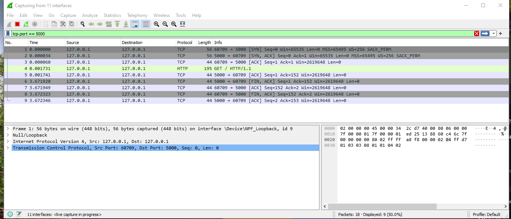

## Commands

```
podman build --tag my-flask:latest .
podman run -p 5000:5000 my-flask:latest
```

```
javac Client.java
java Client
```

## Result
```
podman run -p 5000:5000 my-flask:latest
[2023-05-26 14:09:26 +0000] [1] [INFO] Starting gunicorn 20.0.4
[2023-05-26 14:09:26 +0000] [1] [INFO] Listening at: http://0.0.0.0:5000 (1)
[2023-05-26 14:09:26 +0000] [1] [INFO] Using worker: sync
[2023-05-26 14:09:26 +0000] [2] [INFO] Booting worker with pid: 2
[2023-05-26 14:09:26 +0000] [3] [INFO] Booting worker with pid: 3
[2023-05-26 14:09:26 +0000] [4] [INFO] Booting worker with pid: 4
[2023-05-26 14:09:27 +0000] [5] [INFO] Booting worker with pid: 5
[2023-05-26 14:09:52 +0000] [3] [INFO] pre: GET / [('USER-AGENT', 'Java/17.0.3'), ('HOST', 'localhost:5000'), ('ACCEPT', 'text/html, image/gif, image/jpeg, *; q=.2, */*; q=.2'), ('CONNECTION', 'keep-alive')]
INFO:hello:starting hello_world
[2023-05-26 14:09:56 +0000] [1] [CRITICAL] WORKER TIMEOUT (pid:3)
[2023-05-26 14:09:56 +0000] [3] [INFO] post: GET / [('USER-AGENT', 'Java/17.0.3'), ('HOST', 'localhost:5000'), ('ACCEPT', 'text/html, image/gif, image/jpeg, *; q=.2, */*; q=.2'), ('CONNECTION', 'keep-alive')]
[2023-05-26 14:09:56 +0000] [3] [INFO] Worker exiting (pid: 3)
[2023-05-26 14:09:56 +0000] [4] [INFO] pre: GET / [('USER-AGENT', 'Java/17.0.3'), ('HOST', 'localhost:5000'), ('ACCEPT', 'text/html, image/gif, image/jpeg, *; q=.2, */*; q=.2'), ('CONNECTION', 'keep-alive')]
INFO:hello:starting hello_world
[2023-05-26 14:09:56 +0000] [6] [INFO] Booting worker with pid: 6
[2023-05-26 14:09:59 +0000] [1] [CRITICAL] WORKER TIMEOUT (pid:4)
[2023-05-26 14:09:59 +0000] [4] [INFO] post: GET / [('USER-AGENT', 'Java/17.0.3'), ('HOST', 'localhost:5000'), ('ACCEPT', 'text/html, image/gif, image/jpeg, *; q=.2, */*; q=.2'), ('CONNECTION', 'keep-alive')]
[2023-05-26 14:09:59 +0000] [4] [INFO] Worker exiting (pid: 4)
[2023-05-26 14:09:59 +0000] [7] [INFO] Booting worker with pid: 7
```

